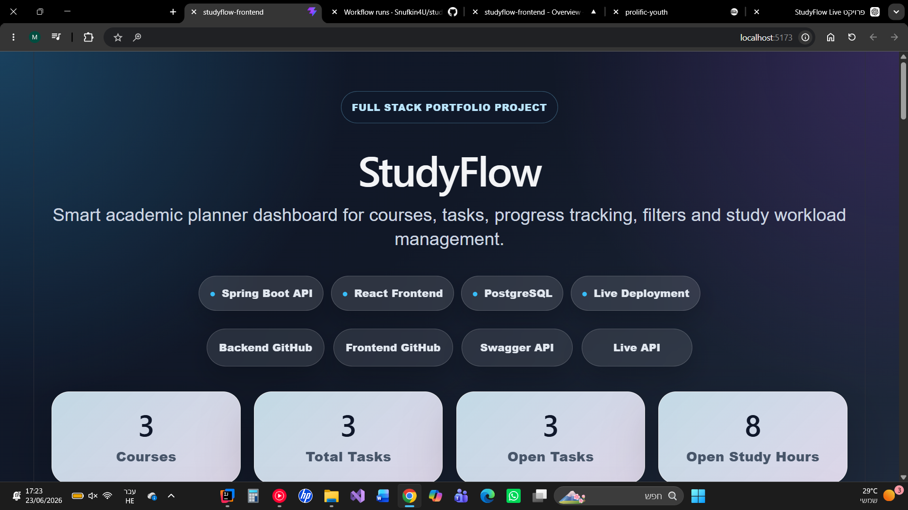
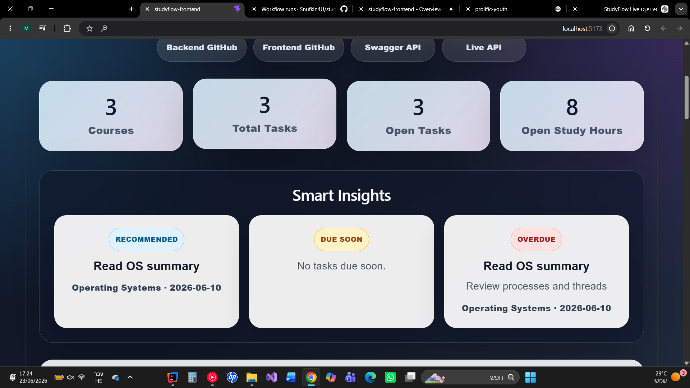
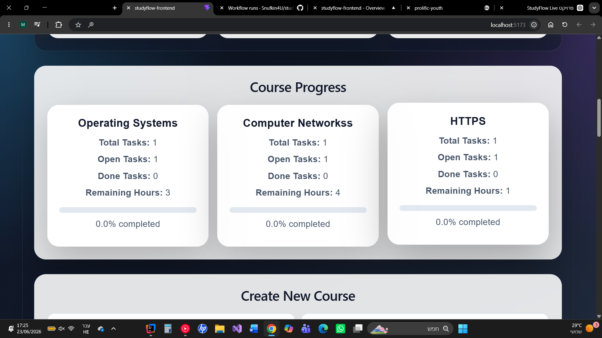
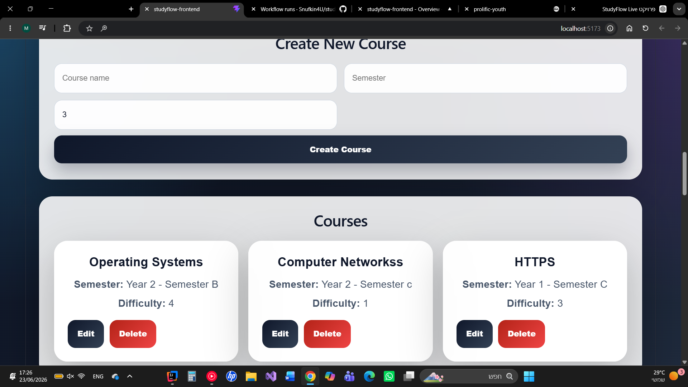

# StudyFlow Frontend


StudyFlow Frontend is a React application for managing academic courses and study tasks.

The project is part of a full-stack portfolio application built with a Spring Boot backend and a React frontend.

---

## Live Demo

Frontend:

```text
https://studyflow-frontend-rust.vercel.app
```

Backend API:

```text
https://studyflow-production-1e15.up.railway.app
```

Example API endpoints:

```text
https://studyflow-production-1e15.up.railway.app/api/courses
https://studyflow-production-1e15.up.railway.app/api/tasks
https://studyflow-production-1e15.up.railway.app/api/dashboard/summary
```

---

## Project Overview

StudyFlow helps students organize their academic workload in one dashboard.

The frontend allows users to:

* View dashboard statistics
* Track course progress
* Create academic courses
* Create study tasks
* Edit existing tasks
* Mark tasks as done
* Delete tasks
* Search and filter tasks
* Sort tasks by different fields

---

## Screenshots

### Dashboard



### Course Progress



### Task Search, Filters and Sorting



### Edit Task



---

## Technologies Used

* React
* Vite
* JavaScript
* CSS
* Fetch API
* GitHub Actions CI

---

## Main Features

### Dashboard Summary

The top dashboard cards display:

* Total courses
* Total tasks
* Open tasks
* Total estimated study hours for open tasks

Data is loaded from:

```http
GET http://localhost:8080/api/dashboard/summary
```

---

### Course Progress

The Course Progress section displays progress for each course.

Each course card includes:

* Total tasks
* Open tasks
* Done tasks
* Remaining estimated hours
* Completion percentage
* Visual progress bar

Data is loaded from:

```http
GET http://localhost:8080/api/dashboard/courses
```

---

### Create Course

Users can create a new course using a form.

Course fields:

* Course name
* Semester
* Difficulty

The form sends a request to:

```http
POST http://localhost:8080/api/courses
```

After creating a course, the course list is refreshed and the new course becomes available in the task creation form.

---

### Create Task

Users can create a new academic task using a form.

Task fields:

* Title
* Description
* Deadline
* Estimated hours
* Priority
* Course

The form sends a request to:

```http
POST http://localhost:8080/api/tasks
```

After creating a task, the dashboard, course progress, and task list are refreshed.

---

### Task List

The task list displays academic tasks as cards.

Each task card shows:

* Title
* Description
* Course
* Deadline
* Status
* Estimated hours
* Priority

---

### Task Search, Filter and Sort

The frontend supports task filtering through the backend API.

Users can:

* Search tasks by text
* Filter by status
* Filter by course
* Sort by deadline
* Sort by priority
* Sort by estimated hours
* Sort by title
* Change sort direction between ascending and descending

Data is loaded from:

```http
GET http://localhost:8080/api/tasks
```

Example request:

```http
GET http://localhost:8080/api/tasks?status=TODO&courseId=1&search=exam&sortBy=deadline&direction=asc&page=0&size=20
```

---

### Edit Task

Users can edit an existing task directly from the task card.

Editable fields:

* Title
* Description
* Deadline
* Estimated hours
* Priority
* Status
* Course

The update request is sent to:

```http
PUT http://localhost:8080/api/tasks/{id}
```

After saving changes, the dashboard and task list are refreshed.

---

### Mark Task as Done

Users can mark an open task as completed.

The request is sent to:

```http
PUT http://localhost:8080/api/tasks/{id}/status?status=DONE
```

After marking a task as done:

* The task list is refreshed
* Dashboard statistics are updated
* Course progress is recalculated

---

### Delete Task

Users can delete a task from the system.

The request is sent to:

```http
DELETE http://localhost:8080/api/tasks/{id}
```

After deletion, the dashboard and task list are refreshed.

---

## Backend Dependency

This frontend requires the StudyFlow backend to be running locally.

Backend repository:

```text
https://github.com/Snufkin4U/studyflow
```

Backend local URL:

```text
http://localhost:8080
```

The frontend communicates with the backend using:

```javascript
const API_BASE_URL = "http://localhost:8080/api";
```

---

## Running Locally

Clone the repository:

```bash
git clone https://github.com/Snufkin4U/studyflow-frontend.git
```

Enter the project folder:

```bash
cd studyflow-frontend
```

Install dependencies:

```bash
npm install
```

Run the development server:

```bash
npm run dev
```

On Windows PowerShell:

```powershell
npm.cmd run dev
```

The application usually runs on:

```text
http://localhost:5173
```

If port `5173` is already in use, Vite may use another port such as:

```text
http://localhost:5174
http://localhost:5175
```

---

## Available Scripts

### Start development server

```bash
npm run dev
```

### Build production version

```bash
npm run build
```

### Preview production build

```bash
npm run preview
```

---

## GitHub Actions CI

This repository includes a GitHub Actions workflow that runs automatically on push and pull request.

The CI pipeline runs:

* `npm ci`
* `npm run build`

This verifies that the frontend builds successfully after each change.

---

## Related Repository

Backend repository:

```text
https://github.com/Snufkin4U/studyflow
```

---

## Current Project Status

Completed frontend features:

* Dashboard summary cards
* Course progress cards
* Progress bar per course
* Create course form
* Create task form
* Task list
* Task search
* Task status filter
* Task course filter
* Task sorting
* Edit task
* Mark task as done
* Delete task
* Responsive CSS layout
* GitHub Actions CI

---

## Future Improvements

Possible future improvements:

* Edit course support
* Delete course support from the UI
* Pagination controls in the frontend
* Better success and error message handling
* Better loading states
* Authentication pages
* Deployment
* Screenshots in README

---

## Author

Maor Cohen

GitHub:

```text
https://github.com/Snufkin4U
```
